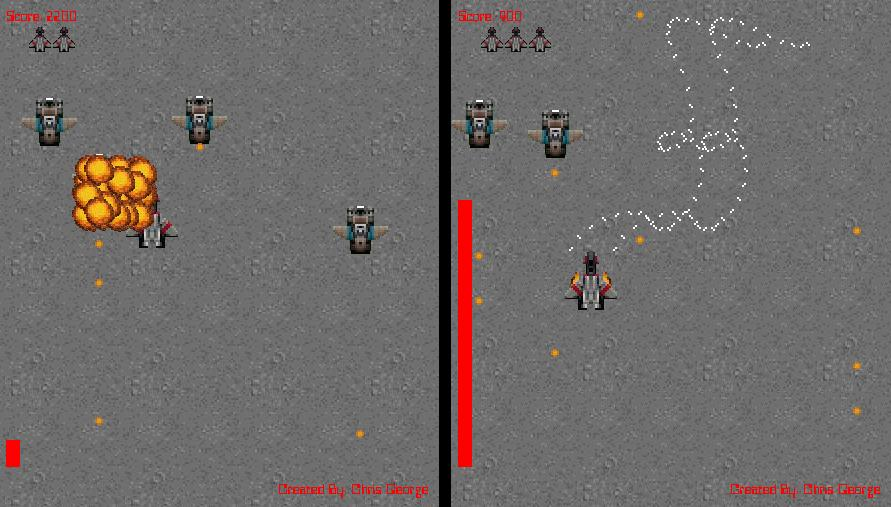



## Raptor in VB

### Description

This project demonstrates how to use native VB to create flicker free graphics for use in a game. This game is like Raptor Call of the Shadows. I did it to demonstrate that you can create a simple game without directx or api's. Learn how to do transparencies, collision detection, and simple ai. Please leave comments.
 
### More Info
 

             |
---                |---
**Submitted On**   |2002-04-03 17:22:28
**By**             |[Chris George](https://github.com/Planet-Source-Code/PSCIndex/blob/master/ByAuthor/chris-george.md)
**Level**          |Intermediate
**User Rating**    |4.8 (133 globes from 28 users)
**Compatibility**  |VB 5\.0, VB 6\.0
**Category**       |[Graphics](https://github.com/Planet-Source-Code/PSCIndex/blob/master/ByCategory/graphics__1-46.md)
**World**          |[Visual Basic](https://github.com/Planet-Source-Code/PSCIndex/blob/master/ByWorld/visual-basic.md)
**Archive File**   |[Raptor\_in\_68406432002\.zip](https://github.com/Planet-Source-Code/chris-george-raptor-in-vb__1-33395/archive/master.zip)

